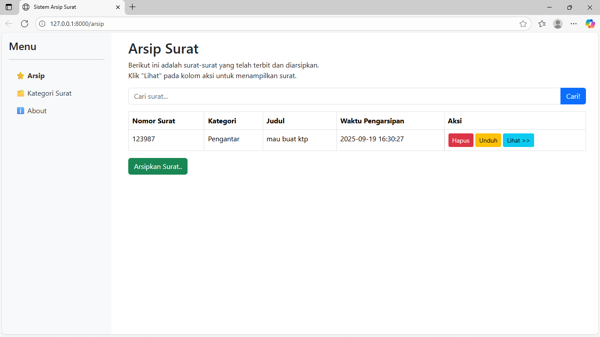
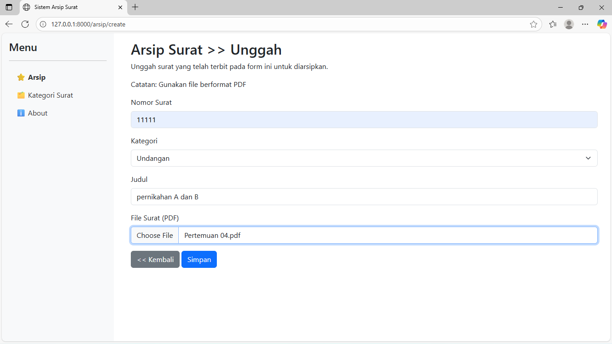
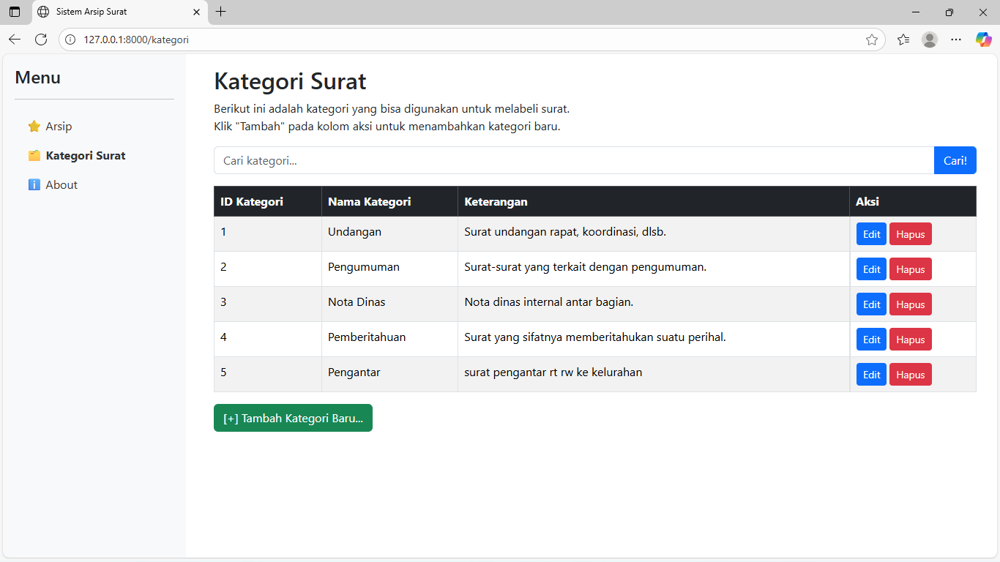

# Proyek Aplikasi Arsip Surat Desa Karangduren

Aplikasi web sederhana yang dibangun menggunakan Laravel untuk memenuhi tugas Uji Kompetensi.

## 📝 Tujuan Aplikasi

Aplikasi ini bertujuan untuk menyediakan sistem digital bagi Kelurahan Karangduren untuk mengarsipkan, mencari, dan mengelola surat-surat resmi yang masuk dan keluar dalam format PDF.

## ✨ Fitur-Fitur Utama

-   **Manajemen Arsip Surat:**
    -   Mengunggah (upload) surat baru dalam format PDF.
    -   Melihat daftar semua surat yang telah diarsipkan.
    -   Menghapus arsip surat dengan konfirmasi.
    -   Mencari surat berdasarkan judul.
-   **Manajemen Kategori Surat:**
    -   Menambah, mengubah, dan menghapus kategori surat.
-   **Fitur Lainnya:**
    -   Mengunduh (download) file PDF surat.
    -   Melihat pratinjau (preview) file PDF langsung di browser.

## 🚀 Cara Menjalankan Aplikasi

1.  **Clone Repository:**
    ```bash
    git clone [https://github.com/Seto-ai/arsip-surat-desa.git]
    cd arsip-surat-desa
    ```
2.  **Instalasi Dependensi:**
    ```bash
    composer install
    ```
3.  **Konfigurasi Environment:**
    -   Salin file `.env.example` menjadi `.env`.
    -   Buat database baru (misalnya `db_arsip_surat`).
    -   Sesuaikan konfigurasi database di file `.env` (DB_DATABASE, DB_USERNAME, DB_PASSWORD).
4.  **Generate Key & Migrasi:**
    ```bash
    php artisan key:generate
    php artisan migrate --seed
    ```
5.  **Buat Storage Link:**
    ```bash
    php artisan storage:link
    ```
6.  **Jalankan Server:**
    ```bash
    php artisan serve
    ```
    Aplikasi akan berjalan di `http://127.0.0.1:8000`.

## 📸 Screenshot Aplikasi



